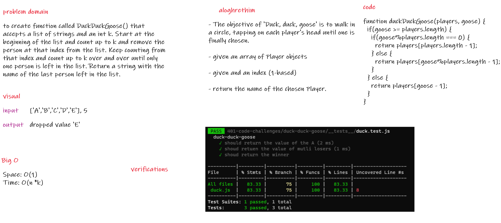

# duckDuckGoose

## Challenge

To craete a function called DuckDuckGoose() that accepts a list of strings and an int k. Start at the beginning of the list and count up to k and remove the person at that index from the list. Keep counting from that index and count up to k over and over until only one person is left in the list. Return a string with the name of the last person left in the list.

## Approach & Efficiency

* Space: O(1)

* Time: O(n*k)

## whiteboard

