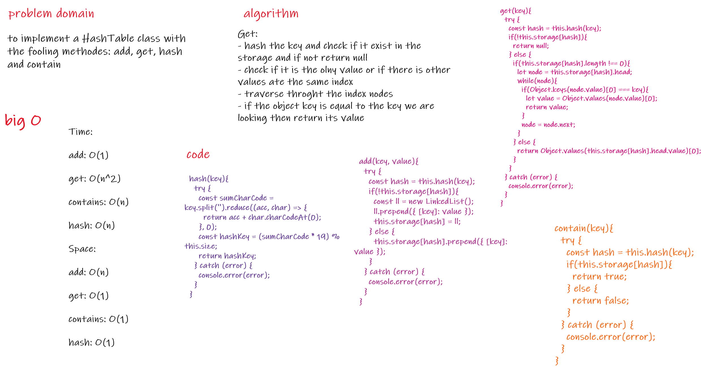
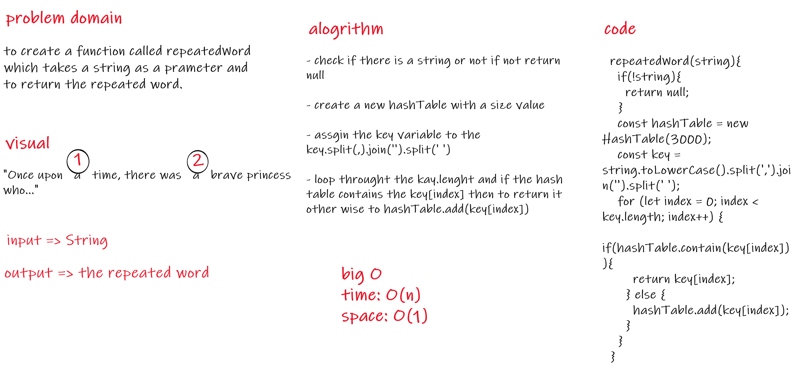
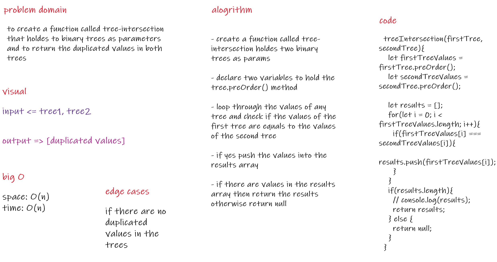

# Hash tables
>
Hash table (hash map) is a data structure that implements an associative array abstract data type, a structure that can map keys to values. A hash table uses a hash function to compute an index, also called a hash code, into an array of buckets or slots, from which the desired value can be found. During lookup, the key is hashed and the resulting hash indicates where the corresponding value is stored.

## Challenge

* add Arguments: key, value Returns: nothing This method should hash the key, and add the key and value pair to the table, handling collisions as needed.

* get Arguments: key Returns: Value associated with that key in the table

* contains Arguments: key Returns: Boolean, indicating if the key exists in the table already.

* hash Arguments: key Returns: Index in the collection for that key

* repeatedWord Arguments: string Returns: repeated word into the string sentance.

* tree-intersection Arguments: Two Binary Tress Returns: the dublicated nodes values in the fisrt and second tree

## Approach & Efficiency

1. Time:

    * add: O(1)

    * get: O(n^2)

    * contains: O(n)

    * hash: O(n)

    * repeatedWord: O(n)

    * tree-intersection: O(n)

2. Space:

    * add: O(n)

    * get: O(1)

    * contains: O(1)

    * hash: O(1)

    * repeatedWord O(1)

    * tree-intersection: O(n)

## HashTable implementation UML

## RepeatedWord UML

## Tree-intersection UML

