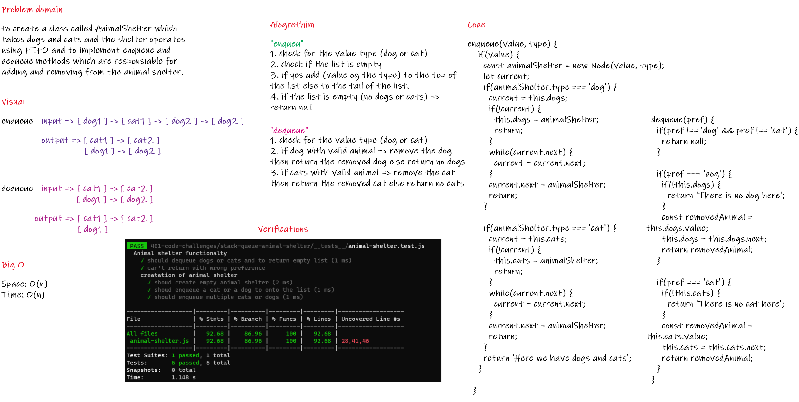

# Animal Shelter
>
1. Create a class called AnimalShelter which takes dogs and cats.

2. The shelter operates using a first-in, first-out approach.

3. Implement two methods enqueue and dequeue.

## Approach & Efficiency

* **Space: O(n)**

* **Time: O(n)**

## Whiteboard

