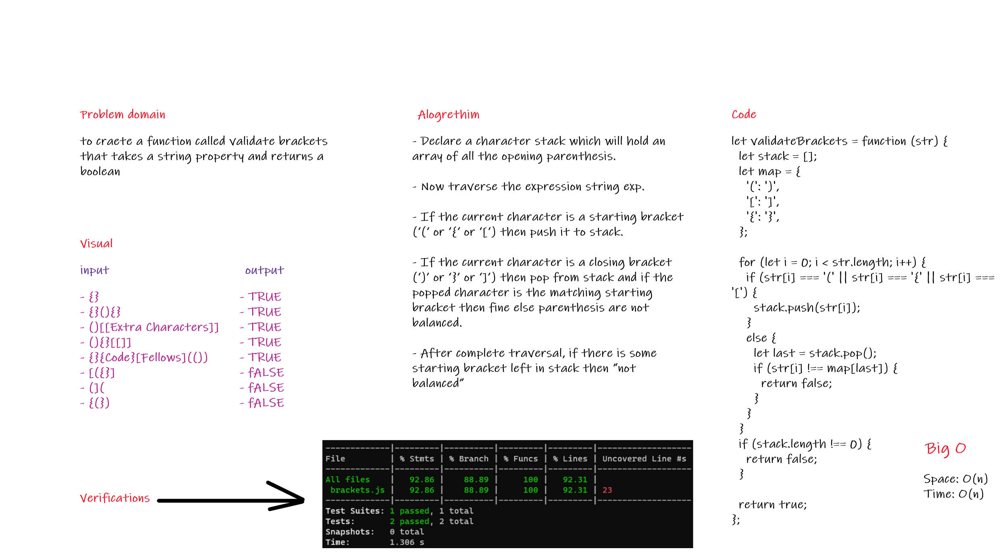

# Code Challenge 13 Validate Brackets

## Challenge

to craete a function called validate brackets that takes a string property and returns a boolean

## Approach && Efficiency

* Space = O(n)

* Time = O(n^3)

## Whiteboard

