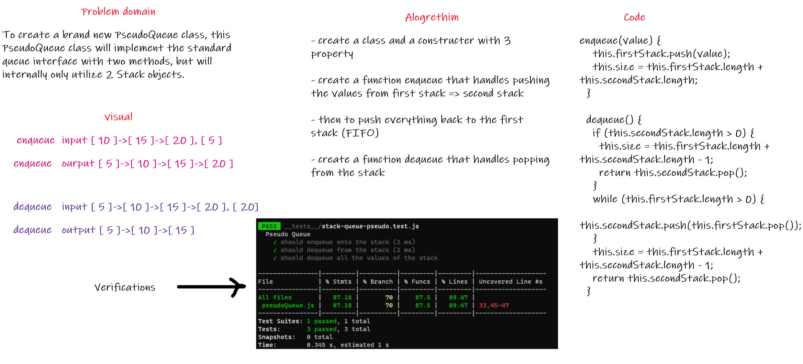

# Pseudo Queue
>
## Challenge

To create a brand new PseudoQueue class, this PseudoQueue class will implement the standard queue interface with two methods, but will internally only utilize 2 Stack objects.

* **Methods**

  * enqueue(value) inserts value into the PseudoQueue, using a first-in, first-out.

  * dequeue() extracts a value from the PseudoQueue, using a first-in, first-out.

## Approach & Efficiency

* enqueue() - time complexity is O(n)

* dequeue() - time complexity is O(1)

## Whiteboard

