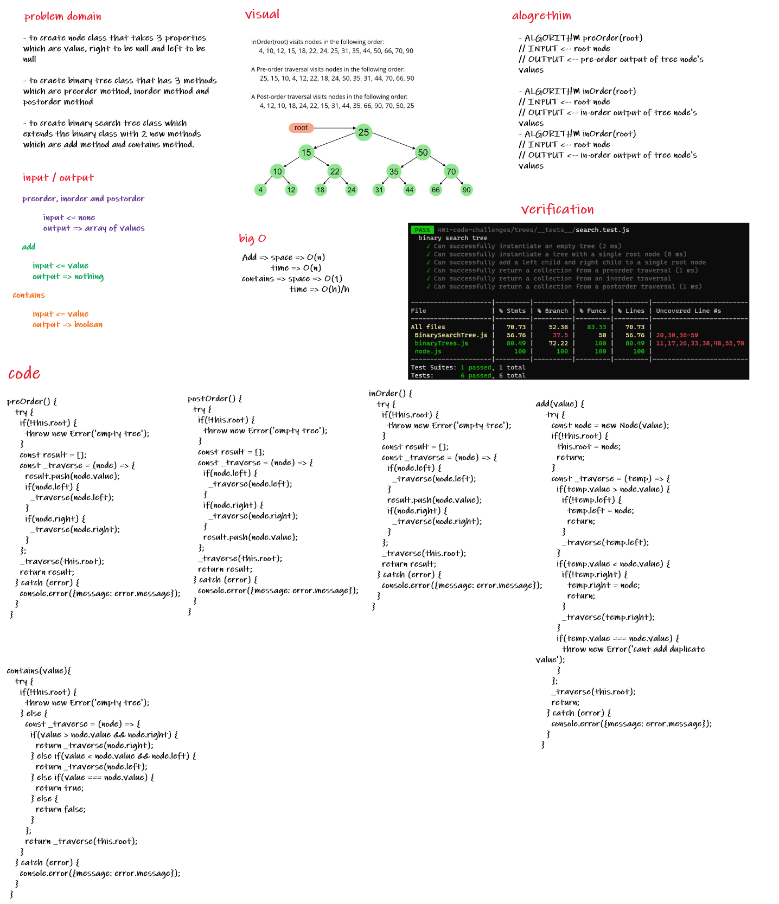
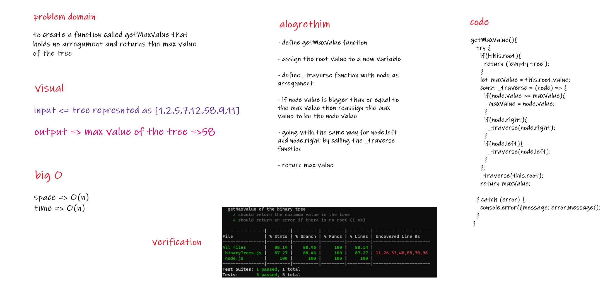

# Trees
>
## challenge

1. Create a Node class that has properties for the value stored in the node, the left child node, and the right child node.

2. Create a Binary Tree class
  
    * Define a pre order method for traversing the tree.
  
    * Define a in order method for traversing the tree.
  
    * Define a post order method for traversing the tree.

3. Create a Binary Search Tree class

    * Create an add method to insert in the tree in right location

    * Create a contains method to search for values in tree.

## Approach & Efficiency

### Space

* add - O(n)

* contains - O(1)

### Time

* add - O(n)

* contains - O(h) where h is the hight of tree.

## whiteboard

---

## Code challenge 16: Get Max Value Of The Tree

### challange

To create a finction that holds no arreguments and to return the maximum value in the tree

### Efficiency

1. Space => O(n)

2. Time => O(n)

### whiteboard

