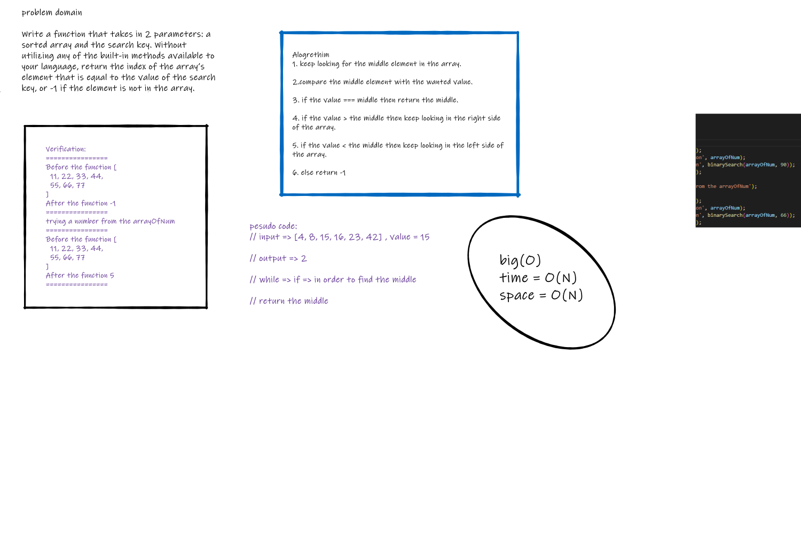

# Code Challenge 401 - Class02
>
## BinarySearch

**We are required to create an algorithm through which we can search for a value in an array and return either the index where the value is placed or -1 if the value doesn't exist in the array .**

## Whiteboard Process

---

## Approach & Efficiency

---

1. **Search for middle index element.**

2. **Change the search boundary on each iteration in order to keep looking for the middle.**

3. **The While loop will keep running until finds the value or it will break if the search failed.**
